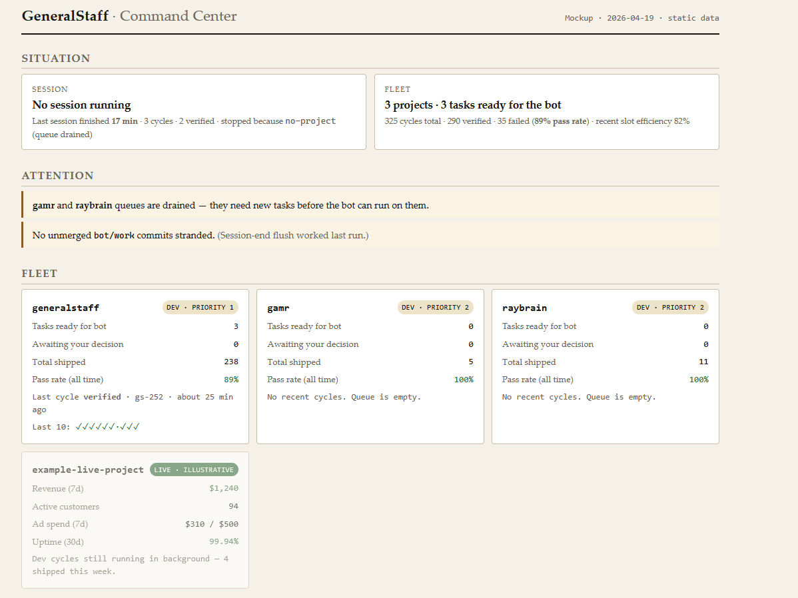

# GeneralStaff



**Open-source autonomous engineering that refuses to ship slop.**
**Your code. Your keys. Your control.**

A meta-dispatcher that runs Claude Code agents on your local projects.
Verification gate you can't prompt around. Hands-off lists per project.
Full audit log of every prompt, response, tool call, and diff in your
own repo. Open-source alternative to closed SaaS bot platforms.

> **Status:** v0.1.0 tagged 2026-04-19. **1,628 passing tests** across
> 48 files. Tests doubling as a gate cross-check: a cycle only verifies
> if the suite passes. Six managed projects cycling. Cross-platform
> (Windows, macOS, Linux).
>
> **Shipped:**
>
> - **Phases 1–4:** sequential MVP, multi-provider LLM routing,
>   cross-project generality, opt-in parallel worktrees.
> - **Phase 5:** visual anchor (terminal dashboards).
> - **Phase 6:** local web dashboard at `generalstaff serve`.
>   Fleet overview, per-project drill-down, single-cycle detail,
>   live session tail via SSE, attention inbox.
> - **Phase 7:** pluggable engineer. `engineer_provider: aider`
>   routes cycles through aider + OpenRouter (Qwen 3.6+ Plus)
>   instead of `claude -p`. 10-task benchmark cleared 80% verified
>   on qwen3.6-plus. Per-task routing
>   (`task.engineer_provider`) mixes engineers by task complexity.
>   Benchmark details in
>   `docs/internal/PHASE-7-BENCHMARK-2026-04-20.md`.
> - **Creative-work opt-in:** per-project flag with voice
>   references and human-in-the-loop draft review. Policy in
>   `docs/internal/RULE-RELAXATION-2026-04-20.md`.
> - **Mode B registrations:** GS wraps projects that already have
>   their own bot infrastructure (catalogdna pattern). It acts as a
>   discipline layer around the existing loop, not a replacement.
>   See `docs/internal/USE-MODES-2026-04-20.md`.

> **Built by itself.** GeneralStaff is registered as its own first
> managed project. Every verified commit in this repo passed the
> same verification gate, scope-match reviewer, and hands-off check
> the tool ships with. Read
> [`state/generalstaff/PROGRESS.jsonl`](state/generalstaff/PROGRESS.jsonl)
> to count the rejections yourself, including the cycles the system
> caught itself being wrong.

## Contents

- [Built in 4 days](#built-in-4-days)
- [The problem](#the-problem)
- [The approach](#the-approach)
- [What it actually catches](#what-it-actually-catches)
- [What it looks like](#what-it-looks-like)
- [Quickstart](#quickstart)
- [Why this over the alternatives](#why-this-over-the-alternatives)
- [Works alongside](#works-alongside)
- [Opt-in knobs](#opt-in-knobs)
- [Who this is for](#who-this-is-for)
- [The Hammerstein framing](#the-hammerstein-framing)
- [Hard rules](#hard-rules)
- [Roadmap](#roadmap)
- [Documentation](#documentation)
- [Contributing](#contributing)
- [Support](#support)
- [License](#license)

## Built in 4 days

On 2026-04-15 this repo was scaffold + Phase 0 design docs with no
executable code (see `docs/internal/PIVOT-2026-04-15.md` for the day it was
rescoped from "personal nightly dispatcher" to "open-source
alternative to Polsia"). On 2026-04-19 it tagged v0.1.0.

Between those two dates, dogfooding itself the whole time:

- **1,407 commits**, of which **200** are shipped task commits
  (one per `gs-XXX` feature or fix landing on master)
- **1,628 passing tests** across 48 test files (of which 4 cover
  the symlink-aware hands-off gate added in the pre-HN audit below)
- **20,500+ lines of TypeScript** in `src/`
- **211 verified + 20 rejected + 2 weak** reviewer verdicts on its
  own diffs. The verification gate caught and rolled back 8.6% of
  what the engineer proposed, including hands-off violations on
  `src/safety.ts`, `src/reviewer.ts`, and `src/prompts/`.
- Six managed projects cycling (itself, `gamr`, `raybrain`,
  `devforge`, `bookfinder-general`, `catalogdna`).
- Two pre-launch security audits. The first fixed five
  HIGH/MEDIUM findings. The second caught a symlink bypass on the
  hands-off check plus a handful of low-severity hardening items.
  Both audits landed their fixes in the same pass.

Every cycle in that span wrote a line to
[`state/generalstaff/PROGRESS.jsonl`](state/generalstaff/PROGRESS.jsonl).
`grep '"verdict":"verification_failed"'` it yourself and count the
rejections. The gate is what makes the velocity trustworthy instead
of slop; without it, the commits would be faster and worse.

## The problem

Autonomous coding agents fail in one predictable way: **industrious
without judgment**. Closed SaaS platforms and naive `claude -p` loops
let agents mark tasks as done when tests fail, diffs are empty, or
scope was hallucinated. Polsia's top one-star review complaint on
Trustpilot is false task completions. Nobody is checking the bot's
work against reality, so the damage compounds where you won't see it
until next week.

The pricing model rewards the slop. Closed-SaaS tools charge per
credit whether the project ships or not, so the slop isn't a bug in
their pricing; it's the equilibrium. GeneralStaff refuses to
participate: local-first, BYOK, open audit log, no platform
middleman.

## The approach

```
 dispatcher --> engineer --> verification gate --> reviewer --> audit log
    (picks)    (codes)     (tests must pass)    (scope match)   (open)
```

- **Verification gate** (Hard Rule #6): a Boolean check in the
  dispatcher. Tests must pass, diff must be non-empty, reviewer must
  confirm scope match. A cycle is not marked `done` until all three
  hold. It is code, not a prompt, and it fires on every cycle.
- **Hands-off lists** (Hard Rule #5): per-project glob patterns the
  bot must not touch. The reviewer catches violations and surfaces
  them as true negatives. Empty list = no registration.
- **Worktree isolation:** the bot works in `.bot-worktree` on a
  `bot/work` branch. Your interactive work on `master` never conflicts
  with autonomous cycles, and you review each cycle's diff before
  merging.
- **BYOK billing** (Hard Rule #8): you pay Anthropic, OpenRouter, or
  whoever directly. No platform credits, no SaaS middleman, no revenue
  share.
- **Open audit log** (Hard Rule #9): every prompt, response, tool call,
  and diff in `state/<project>/PROGRESS.jsonl`. Fully reviewable after
  the fact.

Every item above is falsifiable from this repo's own git history. On
2026-04-17 the verification gate caught an autonomous cycle trying to
edit `src/reviewer.ts` (on its own hands-off list) and rejected the
commit. That rejection is in `PROGRESS.jsonl`. Closed SaaS tools can't
show you theirs.

## What it actually catches

The verification gate is not decorative. In this real rejection from
this repo's own audit log, the bot produced a diff modifying three
safety-critical files and the reviewer caught all three:

```json
{
  "event": "reviewer_verdict",
  "cycle_id": "20260417161301_juzs",
  "data": {
    "verdict": "verification_failed",
    "reason": "The diff contains hands-off violations by modifying src/safety.ts and src/reviewer.ts which are explicitly restricted.",
    "hands_off_violations": [
      "src/safety.ts",
      "src/reviewer.ts",
      "src/prompts/"
    ]
  }
}
```

Cycle rolled back. No commit to `master`. The entry above is a
literal line from
[`state/generalstaff/PROGRESS.jsonl`](state/generalstaff/PROGRESS.jsonl).
Grep for `"verdict":"verification_failed"` and count for yourself.
A closed-SaaS tool could not show you this log even if they wanted
to; the log doesn't exist outside their ops.

## What it looks like

The screenshot at the top is the Phase 6 dashboard mockup: a
command-center view with five sections. Current session status, items
that need your attention, per-project fleet cards, dispatch controls,
and a usage sidebar. The dimmed card at the bottom previews how a
post-launch project's card will render once live-mode ingestion lands
(revenue, active users, ad spend, uptime; see
[`docs/internal/UI-VISION-2026-04-19.md`](docs/internal/UI-VISION-2026-04-19.md)).

**What's shipped today:** the data contract. Five JSON view modules
(`fleet-overview`, `task-queue`, `session-tail`, `dispatch-detail`,
`inbox`) and their CLI wrapping. You can run
`generalstaff view fleet-overview --json` right now and get the same
data the dashboard will render. The mockup above lives at
[`web/index.html`](web/index.html) (static HTML, open in any browser).

**What's next:** wrapping the mockup in `Bun.serve` so the dashboard
reads those JSON endpoints live instead of embedded static data. Zero
new dependencies; the view modules already exist.

**Visual direction:** printed paper. Warm cream background, serif
for display, monospace for data, small-caps labels, a single rust
accent used only where something needs your eyes. No SaaS gradients,
no dark-mode-by-default. The earlier Phase 5 visual references (one
reference page per view) live in
[`docs/phase-5-references/`](docs/phase-5-references/).

## Quickstart

### One-line installer (macOS / Linux)

```bash
curl -fsSL https://raw.githubusercontent.com/lerugray/generalstaff/master/install.sh | bash
```

### One-line installer (Windows, PowerShell)

```powershell
irm https://raw.githubusercontent.com/lerugray/generalstaff/master/install.ps1 | iex
```

The installer clones this repo into `./GeneralStaff/`, auto-installs
`bun` if missing (not as root; writes to `$HOME/.bun`), runs
`bun install`, and prints next steps. Safe to re-run. Override the
install location with `GENERALSTAFF_DIR=/your/path`.

### Manual install

Requires `git`, `bash` (on Windows, Git Bash is fine), `bun` 1.2+, and
`claude` (the Claude Code CLI) in your PATH.

```bash
git clone https://github.com/lerugray/generalstaff.git
cd generalstaff
bun install
bun link                                  # makes `generalstaff` a global command
generalstaff doctor                       # verify prerequisites
```

Point it at a project you want the bot to work on:

```bash
generalstaff init /path/to/your-project --id=myproject
# edit projects.yaml -- set engineer_command, verification_command,
# cycle_budget_minutes, and hands_off patterns for the project
generalstaff config                       # pretty-print the parsed config
generalstaff cycle --project=myproject --dry-run
```

Once the dry-run looks right, run a real session:

```bash
generalstaff session --budget=90          # 90-minute cycle budget
generalstaff history --lines=20           # inspect what happened
```

The bot only pushes to `bot/work` on your own remote. Export equals
`git clone`. There is no GeneralStaff server.

### Tested configurations

The full dogfood trail (211 verified cycles, 1,628 passing tests)
ran on **Windows 11 + Claude Code** as the primary engineer. Every
other combination is wired end-to-end and has working test
coverage, but has less real-cycle mileage on it:

- **OS.** macOS and Linux paths exist throughout (shell scripts,
  path resolution, install.sh). The install script smoke-tests
  clean on all three. Expect rougher edges on macOS/Linux than on
  Windows until the community shakes them out.
- **Engineer.** `claude -p` is the default. `engineer_provider: aider`
  with OpenRouter (Qwen 3.6+ Plus) cleared 80% verified on a 10-task
  benchmark (`docs/internal/PHASE-7-BENCHMARK-2026-04-20.md`); it's
  production-ready for bulk scaffolding, not yet the default.
- **Reviewer.** OpenRouter and Ollama are first-class; both ship with
  pre-flight reachability checks. Claude as reviewer is the default
  for interactive sessions; OpenRouter for unattended runs to keep
  pressure off the Claude subscription quota.

If you hit a rough edge on a configuration that isn't the Windows +
Claude default, file it at
[github.com/lerugray/generalstaff/issues](https://github.com/lerugray/generalstaff/issues)
with your `generalstaff version` output and the relevant
`PROGRESS.jsonl` lines. The architecture supports the whole matrix;
the shakedown just hasn't been done for every cell of it yet.

## Why this over the alternatives

- **Polsia, Devin, and similar closed SaaS:** your code lives on their
  infra, you pay per-credit, and the platform operator is liable for
  what the bot commits. Failure mode: confident false completions you
  can't audit. GeneralStaff is local-first, BYOK, and the audit log is
  the interface.
- **Naive `claude -p` loops:** rely on prompt engineering to prevent
  hallucination. Prompts can be ignored; Boolean gates cannot. The
  verification gate catches the ~2% tail of cycles where the engineer
  goes stupid+industrious despite its baseline clever-industrious
  tendency.
- **Hand-rolled nightly scripts:** what GeneralStaff started as, and
  what every non-trivial user ends up writing anyway. This is that
  script, generalized, hardened, and made inspectable.

## Works alongside

GeneralStaff is runtime enforcement — it catches the bot at cycle
boundaries with a verification gate, hands-off list, and audit log.
That's defense at the *execution* layer. You can stack it with
instruction-layer tools that make agents behave better *within* each
cycle:

- **[AGENTS.md / agents-md](https://github.com/TheRealSeanDonahoe/agents-md)**
  — one drop-in rules file that teaches every coding agent to
  push back on bad requests, produce minimal diffs, verify before
  claiming done, and compound learned corrections in a
  Section 11 reactive-pruning log. Works inside Claude Code, Codex,
  Cursor, Gemini CLI, Aider, and the rest. Pair it with
  GeneralStaff per-managed-project: agents-md tightens the engineer
  subprocess, the verification gate catches what slips through.

- **[lean-ctx](https://github.com/tzervas/lean-ctx)** — a context
  runtime for coding agents that compresses file reads, shell
  output, and search results into a compact wire format the agent
  can still reason about. It sits underneath Claude Code (or any
  MCP-capable agent) and typically cuts a meaningful fraction of
  the tokens a session would otherwise burn on repeated reads.
  Complementary here: lean-ctx lowers the per-token cost of your
  interactive sessions, which frees weekly quota for the
  autonomous dispatcher to run more cycles before you hit your cap.

- **[aider](https://aider.chat) + OpenRouter** — as of Phase 7,
  projects can set `engineer_provider: aider` (see
  `projects.yaml.example`) to route the engineer half of each
  cycle to aider + OpenRouter (Qwen3 Coder by default) instead of
  the default `claude -p`. Roughly 40× cheaper per token than
  Claude Sonnet and doesn't touch your Claude weekly cap. Best
  suited for bulk scaffolding; complex or algorithmic work should
  stay on the default claude engineer. Full BYOK — you supply your
  own `OPENROUTER_API_KEY`, nothing is hosted on your behalf.

The combination is defense in depth. Use any of them alone if that
fits; none is a hard dependency of the others.

## Opt-in knobs

Defaults stay conservative on purpose. Autonomous mistakes on other
people's projects cost time to clean up, and most users would rather
pay a bit of friction up front than debug a bad auto-merge later. If
you know what you want, flip any default per-project (or per-task) in
`projects.yaml`. Full schema lives in `projects.yaml.example`. Quick
reference:

| Knob | Effect | Default | Flip when |
|---|---|---|---|
| `engineer_provider: aider` | Route cycles through aider + OpenRouter (Qwen3 / 3.6 Plus) instead of `claude -p` | `claude` | You'd rather not burn Claude subscription quota on bulk scaffolding. Per-cycle OpenRouter cost ~$0.05-0.10. |
| `creative_work_allowed: true` | Allow `creative: true` tasks to dispatch creative-draft cycles (README sections, blog posts, launch copy) with voice references + human-in-the-loop review | `false` | You want bot drafts you can edit, and you've read `docs/internal/RULE-RELAXATION-2026-04-20.md` to understand the guardrails. |
| `auto_merge: true` | Dispatcher auto-merges `bot/work` into your default branch after a clean cycle | `false` (Hard Rule 4 — opt in after 5 clean cycles) | You've watched the bot run cleanly and want to stop merging manually. |
| `dispatcher.max_parallel_slots: N` | Run N cycles per round in parallel | `1` | You have ≥2 projects with real backlogs and wall-clock is the bottleneck. Multiplies reviewer API spend by N. |
| `task.engineer_provider`, `task.engineer_model` | Per-task engineer override | inherits project | Use `claude` for gnarly refactors, `aider` for scaffold work, picking per task. |
| `task.interactive_only: true` | Mark a task bot-unpickable; you handle it interactively | `false` | Tasks that need your taste / judgment but you still want tracked in the queue. |
| `task.creative: true` | Mark a task as creative (drafts, copy) — routes to creative-work path when enabled project-wide | `false` | Drafts you want the bot to produce for human review. |

The Hard Rules (below) hold regardless of knob state. `projects.yaml`
always requires a non-empty `hands_off` list. `bot/work` is the only
branch the bot pushes to. Every prompt, response, and diff lands in
`PROGRESS.jsonl`. Knobs move the defaults; they can't move those.

## Who this is for

The thesis underneath the whole project is that AI tools should make
work more human, not less. The bot grinds the correctness work —
tests, bugs, scaffolds, small features with clear specs. You keep the
judgment work — what to build, what it should feel like, what the
project is actually for. The line between them is what Hard Rule 1
draws, and why the audit log matters: you can see exactly where the
bot stopped.

GeneralStaff is **neutral on project motivation**. It runs whatever you
point it at -- a commercial SaaS, a research tool, an art project, a
satirical anti-startup, a blog four people read, a fake company that
exists to make a point. The dispatcher has no opinion about what your
project *is*; it runs the correctness work on what you tell it.

Polsia assumes you want to build a profitable SaaS. GeneralStaff
doesn't care what you're building. **Bring your own imagination; the
tool runs the execution.**

This is a deliberate design choice. LLMs asked for "a startup idea"
return the mode of their training distribution, which is generic SaaS.
That is why every Polsia-built company looks the same. GeneralStaff's
answer is that the imagination is yours; the tool is a GM, not a
writer. GMs don't write the players' characters -- they run the rules.

Note that Hard Rule #1 (no creative delegation by default) still
holds. Running a non-SaaS project doesn't mean the bot writes the
satire or the research findings for you. The bot does correctness work
(tests, infra, pipelines, bug grinding); you write the creative part.
The tool is neutral on **motivation**, not on **quadrant**.

## The Hammerstein framing

"GeneralStaff" is borrowed from Kurt von Hammerstein-Equord's officer
typology. The clever-industrious "general staff" handle execution and
dispatch on behalf of command -- they don't make strategy, they make
sure strategy gets executed without dropping the plates.

Hammerstein's warning was specifically about the **stupid+industrious**
quadrant: confident officers without judgment. He argued they must be
dismissed at once because they cause unbounded damage. Autonomous
coding agents without verification gates live in that quadrant.
GeneralStaff's architecture -- verification gate, hands-off lists,
default-off creative roles, open audit log -- structurally prevents
it. The architecture is the philosophy.

The typology's more interesting move is ranking **lazy+clever** above
clever+industrious for strategic command. The staff get the
clever-industrious quadrant because execution rewards diligence paired
with judgment; strategy goes to those who do the minimum work that
produces the right answer, because motion-for-its-own-sake is itself a
failure mode. That ranking is the intellectual backbone of Hard
Rule 1: correctness work (tests, bugs, scope) compounds well under
autonomy because diligence and judgment align; creative work (what
to build, how it should feel) breaks when delegated because judgment,
not motion, is what produces it.

Full writeup of the framing and its empirical backing (5 experiments,
22+ bot runs across Ray's other projects, 7 cited alignment papers)
lives in `docs/internal/`.

## Hard rules

All 10 Hard Rules are enforced either in code or by convention. They
cannot be relaxed without an explicit `RULE-RELAXATION-<date>.md` log
file committed alongside the rule change.

1. **No creative work delegation by default.** Engineering and
   correctness work only. Creative agents are opt-in plugins with
   explicit warnings.
2. **File-based state SSOT.** No databases, no SaaS orchestration.
   A local desktop UI is permitted as a viewer/controller.
3. **Sequential cycles for MVP.** Parallel worktrees come later.
4. **Auto-merge off by default.** Users opt in per-project after 5
   clean verification-passing cycles.
5. **Mandatory hands-off lists.** Empty list = no registration.
6. **Verification gate is load-bearing.** A cycle is not `done` until
   tests pass, diff is non-empty, and reviewer confirms scope match.
7. **Code ownership.** Bot only pushes to `bot/work` on your own git
   remote. Export = `git clone`.
8. **BYOK for LLM providers.** API-key default; subscription support
   is opt-in personal-use only.
9. **Open audit log.** Full prompts, responses, tool calls, and diffs
   in `PROGRESS.jsonl` per cycle.
10. **Local-first.** No SaaS tier, no managed offering, no
    GeneralStaff-the-company hosting.

Details and rationale for each: [`docs/internal/RULE-RELAXATION-2026-04-15.md`](docs/internal/RULE-RELAXATION-2026-04-15.md).

## Roadmap

Phase numbering was re-sequenced when multi-project throughput became
the next bottleneck before the planned UI work. The full narrative for
each closed phase lives in a `PHASE-N-COMPLETE-*.md` doc at the repo
root.

- ✓ **Phase 1** (closed 2026-04-17): sequential MVP, independent
  verification gate, reviewer, open audit log. See
  [`docs/internal/PHASE-1-COMPLETE-2026-04-17.md`](docs/internal/PHASE-1-COMPLETE-2026-04-17.md).
- ✓ **Phase 2** (closed 2026-04-17): multi-provider LLM routing
  (Ollama + OpenRouter + Claude), digest narrative, provider registry.
  See [`docs/internal/PHASE-2-COMPLETE-2026-04-17.md`](docs/internal/PHASE-2-COMPLETE-2026-04-17.md).
- ✓ **Phase 3** (closed 2026-04-18 morning): dispatcher generality
  across non-dogfood projects; `gamr` became the first second managed
  project. Five generality gaps surfaced and catalogued; the
  afternoon closure-tail shipped them same-day. See
  [`docs/internal/PHASE-3-COMPLETE-2026-04-18.md`](docs/internal/PHASE-3-COMPLETE-2026-04-18.md).
- ✓ **Phase 4** (closed 2026-04-18 afternoon): parallel worktrees.
  `pickNextProjects(N)` + round-based Promise.all session loop +
  per-provider reviewer concurrency semaphore + efficiency
  observability in the digest and `status --sessions` table. Default
  `max_parallel_slots: 1` preserves Phase 1-3 behaviour. See
  [`docs/internal/PHASE-4-COMPLETE-2026-04-18.md`](docs/internal/PHASE-4-COMPLETE-2026-04-18.md).
- ✓ **Phase 5 visual anchor** (closed 2026-04-18 evening): five
  hand-built dashboard reference views in
  [`docs/phase-5-references/`](docs/phase-5-references/). Establishes
  palette, type stack, and component vocabulary for the UI shell
  without committing to an implementation stack. One Claude Design
  brief anchored the visual system; four hand-built views extended
  it with zero additional design spend.
- ✓ **Phase 6 local web dashboard** (closed 2026-04-20 afternoon):
  local HTTP server (Bun.serve, port 3737) + `generalstaff serve`
  CLI subcommand + shared layout and stylesheet (foundation trio:
  gs-267/268/269) + four route handlers covering the Phase 5 data
  contract — `GET /project/:id` (gs-283), `GET /cycle/:cycleId`
  (gs-284), `GET /tail/:sessionId` Server-Sent Events stream
  (gs-285), `GET /inbox` (gs-286). Read-only v1 per
  [`docs/internal/PHASE-6-SKETCH-2026-04-19.md`](docs/internal/PHASE-6-SKETCH-2026-04-19.md);
  localhost-bound, no auth beyond 127.0.0.1.
- ✓ **Phase 7 engineer-swap** (closed 2026-04-20): pluggable
  engineer providers via `engineer_provider: claude | aider` on
  ProjectConfig. aider + OpenRouter Qwen3.6-plus cleared the 70%
  verified-rate bar (gs-277 benchmark, 8/10 verified) and shipped
  as the default model. Creative-work opt-in (gs-278 Phase A +
  gs-279 Phase B) carved out the first exception to Hard Rule #1
  — per-project `creative_work_allowed: true`, per-task
  `creative: true`, branch routing to `bot/creative-drafts`,
  reviewer skip, voice-reference prompt prepend. First real-world
  creative cycle (bookfinder-general's bf-005) drafted a
  usable-with-light-edit README section now live on public main.
  See [`docs/internal/PHASE-7-BENCHMARK-2026-04-20.md`](docs/internal/PHASE-7-BENCHMARK-2026-04-20.md).
- **Phase 6.5+ (proposed):** UI actions — dispatch sessions from
  the dashboard, edit `tasks.json` from the UI, merge `bot/work`
  with a button. Read-only v1 is the current dashboard; actions
  are the next iteration.
- **Command-room UI aesthetic (proposed):** Kriegspiel-inspired
  high-density map/status layout, borrowed from 19th-century
  Prussian wargaming. See
  [`docs/internal/UI-VISION-2026-04-15.md`](docs/internal/UI-VISION-2026-04-15.md).
- **Public launch:** gated on README polish, `SUPPORTERS.md`, and
  `LICENSE`. Repo is public at `github.com/lerugray/generalstaff`
  as of 2026-04-20. CLI + dashboard both feature-complete for MVP
  value; launch timing is separate from phase completion.

## Documentation

- [`DESIGN.md`](DESIGN.md) -- full architecture sketch (v1 through
  v6, append-only; v6 = Phase 4 parallel worktrees)
- [`docs/internal/PIVOT-2026-04-15.md`](docs/internal/PIVOT-2026-04-15.md) -- the open-source
  pivot decision and original 12-phase plan
- [`docs/internal/PHASE-1-PLAN-2026-04-15.md`](docs/internal/PHASE-1-PLAN-2026-04-15.md) -- the
  Phase 1 plan that shipped
- [`docs/internal/PHASE-4-COMPLETE-2026-04-18.md`](docs/internal/PHASE-4-COMPLETE-2026-04-18.md)
  -- parallel worktrees closure narrative, including the three
  design-decision resolutions and the gs-188 observability surface
- [`projects.yaml.example`](projects.yaml.example) -- config schema
  reference, including the `max_parallel_slots` opt-in
- [`docs/phase-5-references/`](docs/phase-5-references/) -- Phase 5
  UI reference views (fleet, queue, tail, detail, inbox) with a
  README documenting what each establishes and how the vocabulary
  carries across views
- [`CLAUDE.md`](CLAUDE.md) -- instructions for Claude Code sessions
  operating in this repo
- [`docs/internal/research-notes.md`](docs/internal/research-notes.md) -- research on prior art
  (nightcrawler, parallel-cc, Polsia, Continuous-Claude-v3)

## Contributing

See [`CONTRIBUTING.md`](CONTRIBUTING.md) for the short version: correctness
PRs are welcome, taste-work PRs need a conversation first (Hard Rule 1
applies to contributors too), and the best bug report is a snippet of
your own `PROGRESS.jsonl` showing the cycle that failed.

## Support

GeneralStaff is maintained by one person alongside a minimum-wage day
job. Per Hard Rule 10, there is no company layer. Support goes to the
maintainer directly through
[GitHub Sponsors](https://github.com/sponsors/lerugray). See
[`SUPPORTERS.md`](SUPPORTERS.md).

## License

[AGPL-3.0-or-later](LICENSE). Running GeneralStaff as a hosted service
requires offering the corresponding source to users of that service —
the license is chosen deliberately to prevent the SaaS-fork attack
the project positions against.
