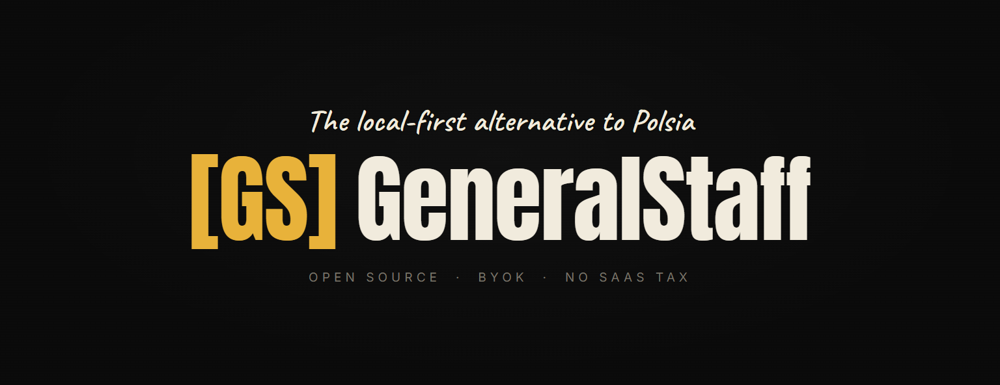

# GeneralStaff



**Verification-gate discipline for autonomous coding agents.**
**Your code. Your keys. Your audit log.**

GeneralStaff treats agentic AI as an adversarial input to your codebase, not a collaborator. Every cycle runs through a Boolean verification gate before producing a commit: tests must pass, the diff must be non-empty, and a separate reviewer must confirm scope match. Hands-off file lists are enforced by the dispatcher, not by prompt. Every prompt, response, tool call, and diff lands in `PROGRESS.jsonl` in your repo. Open source, BYOK, no SaaS layer.

> **Status:** v0.2.0, 1,989 passing tests, 30+ managed projects in the fleet. Cross-platform (Windows, macOS, Linux). Full release notes in [`CHANGELOG.md`](CHANGELOG.md).

> **Built by itself.** GeneralStaff is registered as its own first managed project. Every verified commit in this repo passed the same verification gate, scope-match reviewer, and hands-off check the tool ships with. Read [`state/generalstaff/PROGRESS.jsonl`](state/generalstaff/PROGRESS.jsonl) to count the rejections yourself, including the cycles the system caught itself being wrong.

## The problem

Autonomous coding agents fail in one predictable way: industrious without judgment. They mark tasks done when tests fail. They produce empty diffs and call them complete. They edit files they were told not to edit. They write confident summaries of work they didn't do.

The Replit-style "AI deleted my production database" stories aren't anomalies. They're the predictable outcome of building agent loops on instructions the model can drift from, instead of structural locks the model can't bypass. Closed SaaS platforms charge per credit whether the project ships or not, so the slop isn't a bug in their pricing; it's the equilibrium. Polsia's top one-star review on Trustpilot is false task completions. Nobody is checking the bot's work against reality, so the damage compounds where you won't see it until next week.

The fix is not better prompts. The fix is structural.

## What GeneralStaff does instead

Five mechanisms, each enforced by the dispatcher rather than by instructions to the agent:

- **Verification gate.** A Boolean check that runs after every cycle. Tests must pass. Diff must be non-empty. A reviewer (separate model, separate process, no shared context) must confirm scope match. A cycle is not marked `done` until all three hold. Failure rolls the cycle back. The gate is code, not a prompt, and it fires on every cycle.
- **Hands-off lists.** Per-project glob patterns the bot must not touch. The reviewer checks every diff against the list. A diff touching a hands-off path rolls back. Empty list = no registration.
- **Worktree isolation.** The bot works in `.bot-worktree` on a `bot/work` branch. Your `master` is untouched until you merge. The bot only pushes to `bot/work` on your own remote.
- **BYOK billing.** You pay Anthropic, OpenRouter, or whoever directly. No platform credits, no SaaS middleman, no revenue share, no rate-limit gaming.
- **Open audit log.** Every prompt, response, tool call, and diff in `state/<project>/PROGRESS.jsonl` per cycle. Fully reviewable after the fact. Closed SaaS tools can't show you theirs because the log doesn't exist outside their ops.

Every item above is falsifiable from this repo's own git history.

## What it actually catches

The verification gate is not decorative. This is a real rejection from this repo's own audit log:

```json
{
  "event": "reviewer_verdict",
  "cycle_id": "20260417161301_juzs",
  "data": {
    "verdict": "verification_failed",
    "reason": "The diff contains hands-off violations by modifying src/safety.ts and src/reviewer.ts which are explicitly restricted.",
    "hands_off_violations": [
      "src/safety.ts",
      "src/reviewer.ts",
      "src/prompts/"
    ]
  }
}
```

The bot tried to edit three safety-critical files. The reviewer caught all three. Cycle rolled back, no commit to `master`. The entry above is a literal line from [`state/generalstaff/PROGRESS.jsonl`](state/generalstaff/PROGRESS.jsonl). Grep for `"verdict":"verification_failed"` and count the rest.

## Dogfooding evidence

GeneralStaff has been running its own codebase since 2026-04-15. Numbers from the audit log:

- **1,615+ commits** across the dogfood window, **250+** shipped task commits, all gated.
- **223 verified + 27 rejected** reviewer verdicts on the bot's own diffs. The gate caught and rolled back ~10.8% of what the engineer proposed.
- **30+ managed projects** in the fleet, mix of bot-pickable (`generalstaff`, `gamr`, `raybrain`, `devforge`, `bookfinder-general`) and interactive-only (game-dev work, mission-* tooling, art projects).
- **1,989 passing tests** across 67 test files, including 4 specifically covering the symlink-aware hands-off gate added during pre-launch security audit.
- **Two pre-launch security audits.** First fixed five HIGH/MEDIUM findings. Second caught a symlink bypass on the hands-off check plus low-severity hardening items. Both audits landed their fixes in the same pass.

`grep '"verdict":"verification_failed"' state/generalstaff/PROGRESS.jsonl` and verify the count yourself. The gate is what makes the velocity trustworthy instead of slop. Without it the commits would be faster and worse.

## What GeneralStaff is not

- **Not a Claude wrapper.** Multi-provider from day one. Default engineer is `claude -p`; `aider + OpenRouter` ships as an alternative; Ollama works for unattended runs.
- **Not an alignment tool.** It does not make the agent smarter. It catches the agent at cycle boundaries when it would otherwise commit slop.
- **Not a SaaS.** No hosted offering. No credits. No telemetry. There is no GeneralStaff server. Export equals `git clone`.
- **Not a chat UI.** Co-pilot tools are humans and agents taking turns in a chat window. GeneralStaff is dispatched labor: you write work orders, the dispatcher runs cycles, you read SITREPs.

## Why this over the alternatives

- **Polsia, Devin, and similar closed SaaS:** your code lives on their infra, you pay per-credit, the platform operator is liable for what the bot commits. Failure mode is confident false completions you can't audit. GeneralStaff is local-first, BYOK, and the audit log is the interface.
- **Naive `claude -p` loops:** rely on prompts to prevent hallucination. Prompts can be ignored; Boolean gates cannot. The verification gate catches the ~2% tail where the engineer goes stupid+industrious despite its baseline clever-industrious tendency.
- **Hand-rolled nightly scripts:** what GeneralStaff started as, and what every non-trivial user ends up writing. This is that script, generalized, hardened, and made inspectable.

## Origin

"GeneralStaff" is borrowed from Kurt von Hammerstein-Equord's officer typology: clever/stupid × industrious/lazy. The clever-industrious "general staff" handle execution and dispatch on behalf of command. The stupid-industrious quadrant — confident officers without judgment — Hammerstein argued must be dismissed at once because they cause unbounded damage. Autonomous coding agents without verification gates live in that quadrant.

GeneralStaff's architecture — gate, hands-off lists, default-off creative roles, open audit log — structurally prevents the stupid-industrious failure mode. The architecture is the philosophy.

The framework was developed by a wargame designer thinking about agentic AI failure modes the way wargames think about adversarial conditions: structurally, with explicit failure-mode enumeration, with discipline encoded as rules rather than instructions. Most software engineering does not do this; the genre does not demand it. Wargame design does. Full writeup with empirical backing (5 experiments, 22+ bot runs, cited alignment papers) lives in `docs/internal/`.

## Hard rules

All 10 are enforced in code or by convention. Relaxing any of them requires an explicit `RULE-RELAXATION-<date>.md` log committed alongside the change.

1. **No creative work delegation by default.** Engineering and correctness work only. Creative agents are opt-in plugins with explicit warnings.
2. **File-based state SSOT.** No databases, no SaaS orchestration. A local desktop UI is permitted as a viewer/controller.
3. **Sequential cycles for MVP.** Parallel worktrees opt-in.
4. **Auto-merge off by default.** Users opt in per-project after 5 clean verification-passing cycles.
5. **Mandatory hands-off lists.** Empty list = no registration.
6. **Verification gate is load-bearing.** A cycle is not `done` until tests pass, diff is non-empty, and reviewer confirms scope match.
7. **Code ownership.** Bot only pushes to `bot/work` on your own git remote. Export = `git clone`.
8. **BYOK for LLM providers.** API-key default; subscription support opt-in for personal use.
9. **Open audit log.** Full prompts, responses, tool calls, and diffs in `PROGRESS.jsonl` per cycle.
10. **Local-first.** No SaaS tier, no managed offering, no GeneralStaff-the-company hosting.

Rationale and per-rule context: [`docs/internal/RULE-RELAXATION-2026-04-15.md`](docs/internal/RULE-RELAXATION-2026-04-15.md).

## Quickstart

### One-line installer

```bash
# macOS / Linux
curl -fsSL https://raw.githubusercontent.com/lerugray/generalstaff/master/install.sh | bash
```

```powershell
# Windows PowerShell
irm https://raw.githubusercontent.com/lerugray/generalstaff/master/install.ps1 | iex
```

The installer clones into `./GeneralStaff/`, auto-installs `bun` if missing (writes to `$HOME/.bun`, no root), runs `bun install`, and prints next steps. Override the location with `GENERALSTAFF_DIR=/your/path`. Safe to re-run.

### First-run wizard

```bash
gs welcome
```

A guided ~30-minute briefing for first-time users: provider setup, registering your first project, running one verified cycle so you can see the dispatcher → engineer → verification → reviewer loop work end-to-end before you trust it with real tasks.

### Manual flow

Requires `git`, `bash` (Git Bash works on Windows), `bun` 1.2+, and the `claude` CLI in your PATH.

```bash
generalstaff bootstrap /path/to/project "what this project is" --id=myproject
# review the .generalstaff-proposal/ output, move hands_off.yaml into place
generalstaff register myproject --path=/path/to/project
generalstaff cycle --project=myproject --dry-run
generalstaff session --budget=90
generalstaff history --lines=20
```

The bot only pushes to `bot/work` on your own remote. Full configuration reference in [`projects.yaml.example`](projects.yaml.example).

### Tested configurations

The full dogfood trail (223 verified cycles, 1,854 passing tests) ran on **Windows 11 + Claude Code** as the primary engineer. macOS and Linux paths exist throughout and pass install-script smoke tests; a 2026-05-01 fresh-Mac dogfood validated the bootstrap end-to-end. Real-cycle mileage on macOS/Linux is lighter than on Windows; expect rougher edges in less-trodden paths until the community shakes them out.

If you hit a rough edge, file it at [github.com/lerugray/generalstaff/issues](https://github.com/lerugray/generalstaff/issues) with `generalstaff version` output and the relevant `PROGRESS.jsonl` lines.

## Works alongside

GeneralStaff is runtime enforcement at cycle boundaries. It stacks with instruction-layer tools that improve agent behavior within each cycle:

- **[AGENTS.md / agents-md](https://github.com/TheRealSeanDonahoe/agents-md)** — drop-in rules file that teaches every coding agent (Claude Code, Codex, Cursor, Gemini CLI, Aider) to push back on bad requests and verify before claiming done.
- **[lean-ctx](https://github.com/tzervas/lean-ctx)** — context runtime that compresses file reads and search results into a compact wire format, lowering per-token cost.
- **[aider](https://aider.chat) + OpenRouter** — set `engineer_provider: aider` to route cycles through Qwen3 Coder via OpenRouter (~40× cheaper than Claude Sonnet, doesn't touch the Claude weekly cap). Best for bulk scaffolding; complex work stays on `claude`.

The combination is defense in depth. Use any alone if that fits.

## Sister projects

Three open-source tools share GeneralStaff's posture (your data on disk, your keys for paid providers, no SaaS layer):

- **[mission-brain](https://github.com/lerugray/mission-brain)** — citation-grounded retrieval over your own writing. Cycles ground drafts in your corpus instead of generic LLM voice.
- **[mission-bullet-oss](https://github.com/lerugray/mission-bullet-oss)** — AI-assisted bullet journal (Ryder Carroll method). Cycles work toward this week's priorities as you record them.
- **[mission-swarm](https://github.com/lerugray/mission-swarm)** — swarm-simulation engine that generates audience reactions to a document. Smoke-test launch posts and design specs before shipping.

Each project chooses its own integrations; GeneralStaff assumes none.

## Configuration

Defaults stay conservative on purpose. Autonomous mistakes on other people's projects cost time to clean up. Flip per-project (or per-task) in `projects.yaml`; full schema in [`projects.yaml.example`](projects.yaml.example) and [`docs/conventions/`](docs/conventions/). Common opt-ins:

- `engineer_provider: aider` — route to OpenRouter (Qwen3 Coder) instead of Claude. Bulk scaffolding cost ~$0.05-0.10 per cycle.
- `creative_work_allowed: true` — allow `creative: true` tasks to dispatch creative-draft cycles with voice references and human review (Hard Rule 1 carve-out).
- `auto_merge: true` — dispatcher auto-merges `bot/work` after a clean cycle. Hard Rule 4: opt in after 5 clean cycles.
- `dispatcher.session_budget` — cap consumption in USD, tokens, or cycles. Sessions stop at the cap.
- `dispatcher.max_parallel_slots: N` — run N cycles per round in parallel. Multiplies reviewer API spend by N.

The Hard Rules hold regardless of knob state. Every cycle still lands in `PROGRESS.jsonl`.

## Who this is for

GeneralStaff runs whatever you point it at: a commercial SaaS, a research tool, an art project, a satirical anti-startup, a blog four people read, a fake company that exists to make a point. The dispatcher has no opinion about what the project is; it runs the correctness work on what you tell it.

Polsia assumes you want to build a profitable SaaS. GeneralStaff doesn't care what you're building. **Bring your own imagination; the tool runs the execution.**

This is a deliberate design choice. LLMs asked for "a startup idea" return the mode of their training distribution, which is generic SaaS. That is why every Polsia-built company looks the same. GeneralStaff's answer: the imagination is yours; the tool is a GM, not a writer. GMs run the rules; players write their characters.

Hard Rule 1 still holds. Running a non-SaaS project doesn't mean the bot writes the satire or the research findings for you. The bot does correctness work (tests, infra, pipelines, bug grinding); you write the creative part.

## Roadmap

Recently shipped highlights below. Phase narratives + closure docs are linked from [`CHANGELOG.md`](CHANGELOG.md).

- **Phased autonomous progression (v0.2.x, 2026-05-03/04).** Projects declare phased campaigns in `state/<id>/ROADMAP.yaml`; the dispatcher detects ready phases and emits sentinels for the commander to advance. Opt-in auto-advance, multi-phase rollback, `tasks_template:` placeholder expansion, `launch_gate:` and `git_tag:` completion criteria.
- **Multi-agent orchestration tooling (v0.2.0, 2026-04-25).** Tier 1/2/3 spawn primitives plus inbox-injection routing for parallel Claude Code sessions across managed projects.
- **AGENTS.md wizard (v0.2.0, 2026-04-25).** Conversational discovery wizard at `.claude/skills/agents-md-wizard/` produces an AGENTS.md at register time. Cross-platform agent-config standard, free integration with whatever AI tooling you already use.
- **Usage-budget gate (v0.2.0, 2026-04-21).** Cap sessions on USD / tokens / cycles. Reads `ccusage` for real spend on Claude Code 5-hour windows.
- **Phase 7 engineer-swap (v0.1.0, 2026-04-20).** `engineer_provider: aider` ships at 80% verified rate on a 10-task benchmark. Creative-work opt-in (Hard Rule 1 carve-out) lands here.
- **Phase 6 web dashboard (v0.1.0, 2026-04-20).** Local Bun.serve dashboard at `gs serve`. Read-only v1; `/phase` advance form button shipped 2026-05-04 as the first write-mode action.
- **Phases 1-5 (closed 2026-04-17/18).** Sequential MVP, multi-provider routing, dispatcher generality, parallel worktrees, visual anchor.

Proposed but not scheduled: broader UI write-mode, non-programmer-friendly UI/UX path, command-room kriegspiel aesthetic. See [`docs/internal/UI-VISION-2026-04-15.md`](docs/internal/UI-VISION-2026-04-15.md).

## Documentation

- [`DESIGN.md`](DESIGN.md) — architecture sketch (v1 through v6, append-only)
- [`CHANGELOG.md`](CHANGELOG.md) — full release notes
- [`projects.yaml.example`](projects.yaml.example) — config schema reference
- [`docs/conventions/`](docs/conventions/) — usage-budget, roadmap, integrations
- [`docs/internal/`](docs/internal/) — design decisions, phase-closure narratives, research notes
- [`AGENTS.md`](AGENTS.md) — cross-platform agent-config artifact, read by Claude Code, Cursor, Aider, Codex, Zed
- [`scripts/orchestration/README.md`](scripts/orchestration/README.md) — four-tier orchestration tooling

## Contributing

See [`CONTRIBUTING.md`](CONTRIBUTING.md). Correctness PRs welcome. Taste-work PRs need a conversation first (Hard Rule 1 applies to contributors). The best bug report is a snippet of your own `PROGRESS.jsonl` showing the cycle that failed.

## Support

GeneralStaff is maintained by one person alongside a minimum-wage day job. Per Hard Rule 10, there is no company layer. Support goes to the maintainer directly through [GitHub Sponsors](https://github.com/sponsors/lerugray). See [`SUPPORTERS.md`](SUPPORTERS.md).

## License

[AGPL-3.0-or-later](LICENSE). Running GeneralStaff as a hosted service requires offering the corresponding source to users of that service — chosen deliberately to prevent the SaaS-fork attack the project positions against.
