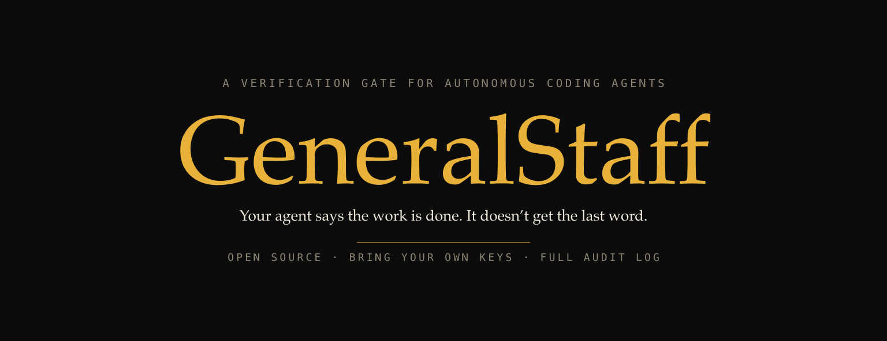

# GeneralStaff

[](https://github.com/lerugray/generalstaff/actions/workflows/test.yml)



## In plain English

GeneralStaff lets you describe, in plain words, the software you want, then puts AI to work building it while you stay in charge. The catch with letting AI write code on its own is that it tends to report a job as finished when it isn't. GeneralStaff stops that. Before any work is accepted it has to pass a check: the tests must pass, real changes must exist, and a second AI has to confirm the work matches what was asked. If it fails, the work is thrown out instead of kept, and you can read a full record of everything the AI did.

The maintainer is a game designer with no coding background. He builds and runs GeneralStaff by directing AI in plain English rather than writing the code himself. The craft is in structuring the work and verifying it until you can trust the result. GeneralStaff itself was built that way.

**Verification-gate discipline for autonomous coding agents.**
**Your code. Your keys. Your audit log.**

GeneralStaff treats agentic AI as an adversarial input to your codebase. Every cycle runs through a Boolean verification gate before producing a commit: tests must pass, the diff must be non-empty, a separate reviewer must confirm scope match. The dispatcher enforces hands-off file lists. Every prompt, response, tool call, and diff lands in `PROGRESS.jsonl`. Open source, BYOK, no SaaS layer.

> **Status:** v0.10.0, 2,203 passing + 4 skipped across 2,207 tests in 80 files, and 30+ managed projects. CI is the source of truth for the test count. Cross-platform (Windows, macOS, Linux). Current `master` fails closed on worktree/SHA preflight and rollback failure (blocking the project for the session), checks C-quoted and renamed paths without quote/rename gaps, removes Bash from the reviewer, and masks likely secrets in persisted artifacts and reviewer egress. Autonomous mode remains opt-in, default-off, and never auto-pushes. Release notes: [`CHANGELOG.md`](CHANGELOG.md).

## The problem

Autonomous coding agents fail in one predictable way: industrious without judgment. They mark tasks done when tests fail. They produce empty diffs and call them complete. They edit files you told them not to touch, then write a confident summary of work they didn't do.

That is the equilibrium any agent loop settles into when it rests on instructions the model can drift from instead of locks it can't bypass. Closed SaaS platforms charge per credit whether the project ships or not. Nobody checks the bot's work against reality, so the damage compounds where you won't see it until next week.

Better prompts won't fix this. Structure will.

## What GeneralStaff does instead

Six mechanisms enforced by the dispatcher:

- **Verification gate.** After every cycle: tests pass, diff non-empty, separate reviewer confirms scope match. A cycle is not `done` until all three hold. Failure rolls the cycle back. The gate is code, not a prompt, and it fires on every cycle.
- **Hands-off lists.** Per-project glob patterns the bot cannot touch. Reviewer checks every diff against the list. Violation → rollback. Empty list = no registration.
- **Worktree isolation.** The bot works in `.bot-worktree` on a `bot/work` branch. Your `master` is untouched until you merge. Bot pushes to `bot/work` on your remote, nowhere else.
- **Repo-structure orientation + agent self-planning.** Every cycle, the engineer gets a ranked structural map of the repo at the top of its prompt (via `aider --show-repo-map`, capped at ~700 tokens) so it skips the cold-start re-discovery, then plans its own work and proceeds without waiting on a human to approve the plan. The map is best-effort: if it can't be built, the cycle dispatches exactly as before. The `hands_off` list and the verification gate still bind regardless of the agent's plan.
- **BYOK billing.** You pay Anthropic, OpenRouter, or whoever directly. No platform credits, no SaaS middleman, no revenue share.
- **Open audit log.** Full prompts, responses, tool calls, and diffs in `state/<project>/PROGRESS.jsonl`. Grep-able, reviewable. Closed SaaS tools can't show you theirs.

### Autonomous mode (v0.8.0, opt-in)

The six mechanisms above govern work you *queue*. Autonomous mode (`gs autonomous`) adds the step in front: it proposes the work too, then puts it through the same gates. For each opted-in project it surveys real state (MISSION + git log + queued tasks), scopes concrete next work via an off-cap model, runs the Hammerstein gate to judge **keep/reject** *and* classify **bot-safe vs design-fork**, then routes. Mechanical work is dispatched through the normal cycle. Taste, scope, revenue and legal calls surface to you (`gs forks`), as does anything held back on a live product. It is **default-off** (a project without an `autonomous:` block is never touched) and **never pushes or merges**: dispatched work lands on the bot branch and in a review ledger (`gs branches`), and the merge stays your call. The decision and dispatch ledgers are local and gitignored. The machinery is open source; which projects you run and what they decide is yours. See [`projects.yaml.example`](projects.yaml.example) for the config.

## What it catches

This is a real rejection from this repo's audit log:

```json
{
  "event": "reviewer_verdict",
  "cycle_id": "20260417161301_juzs",
  "data": {
    "verdict": "verification_failed",
    "reason": "The diff contains hands-off violations by modifying src/safety.ts and src/reviewer.ts which are explicitly restricted.",
    "hands_off_violations": [
      "src/safety.ts",
      "src/reviewer.ts",
      "src/prompts/"
    ]
  }
}
```

The bot tried to edit three safety-critical files. The reviewer caught all three. Cycle rolled back. The entry above is a line from [`state/generalstaff/PROGRESS.jsonl`](state/generalstaff/PROGRESS.jsonl). Grep for `"verdict":"verification_failed"` and count the rest.

**Dogfooding numbers since 2026-04-15:**

- 223 verified and 27 rejected reviewer verdicts. The gate threw out ~10.8% of what the engineer proposed.
- 2,203 passing + 4 skipped across 2,207 tests in 80 files; the CI badge above is the source of truth as the suite moves.
- Two pre-launch security audits. First fixed five HIGH/MEDIUM findings. Second caught a symlink bypass on the hands-off check.
- Every verified commit in this repo passed the same gate the tool ships with.
- The same gate-and-ledger discipline runs the maintainer's 30+ project portfolio beyond this repo: Next.js web apps, Rust and Godot games, a publishing pipeline, and a Super Nintendo operating system.

`grep '"verdict":"verification_failed"' state/generalstaff/PROGRESS.jsonl` and verify the count. The gate makes the velocity trustworthy.

## What the gate doesn't catch

Real failure modes from the audit log:

- **Engineer crashes before producing a diff.** With a stub `engineer_command` on a Mode-B project, a Windows worktree-junction race, or a missing toolchain, the gate has nothing to verify. Set `interactive_only: true` on Mode-B projects and declare `expected_touches`.
- **Empty-diff cycles.** When a project's bot-pickable inventory is thin, the engineer runs cleanly and reports nothing-to-do. The cycle returns `verified_weak`. Watch substantive landings vs. `verified_weak`, not raw cycle count. The `gs inventory-audit` command surfaces this at fleet level.
- **Scope-match is not correctness.** The reviewer confirms the diff matches declared `expected_touches` and respects hands_off. It does not check correctness. The engineer's tests are the correctness signal; if they pass for the wrong reason, the gate ratifies the cycle.
- **Push is best-effort.** The gate runs at commit time. Pushing to origin is opportunistic and fails silently on offline or auth-expired states. The final-sweep step is load-bearing.
- **Picker rotation can starve projects.** Round-robin within the ready set means some projects may not get selected across a session.

File counterexamples on the [issue tracker](https://github.com/lerugray/generalstaff/issues).

## What GeneralStaff is not

- **Not a Claude wrapper.** Five engineer providers today: `claude -p`, `aider` against any OpenAI-compatible endpoint (OpenRouter, DeepSeek, Ollama local or cloud), the Grok CLI, plus experimental OpenAI Codex CLI and Moonshot kimi-code CLI. Reviewers can run on a different provider than the engineer. All on your own keys / subscriptions.
- **Not an alignment tool.** It does not make the agent smarter. It catches the agent at cycle boundaries.
- **Not a SaaS.** No hosted offering, no credits, no telemetry. The optional dashboard is a local server on your machine. Export = `git clone`.
- **Not a chat UI.** Dispatched labor: you write work orders, the dispatcher runs cycles, you read SITREPs.

## Why this over the alternatives

- **vs. Polsia / Devin / closed SaaS:** your code lives on their infra, you pay per credit, you can't verify what the bot actually did. GeneralStaff is local-first, BYOK, audit-log-first.
- **vs. Naive `claude -p` loops:** prompts can be ignored; Boolean gates cannot. The verification gate catches the tail where the engineer goes stupid+industrious.
- **vs. Hand-rolled nightly scripts:** what GeneralStaff started as. This is that script, hardened and made inspectable.

## Origin

Named for Kurt von Hammerstein-Equord's officer typology: clever/stupid × industrious/lazy. The "general staff" quadrant handles execution on behalf of command. Confident officers without judgment sit in the stupid-industrious quadrant, where they cause unbounded damage. Autonomous coding agents without verification gates live there.

The architecture is the philosophy: gate, hands-off lists, default-off creative roles, open audit log. A wargame designer built it, thinking about AI failure modes the way a wargame treats adversarial conditions: enumerate them explicitly, encode the discipline as rules.

## What this became

GeneralStaff started as the dispatcher this README documents. Daily use produced a second thing: a written operating discipline for directing AI at all. The operator keeps rules files that record each hard-won lesson once so no future session repeats it, ledgers that carry open decisions until someone resolves them, and verification conventions that treat a model's "done" as a claim to check. The dispatcher enforces that discipline at cycle boundaries. The discipline itself now runs the operator's whole portfolio, on any machine and any model, and a session started tomorrow picks up tonight's open decisions from the ledger.

The clearest proof is [SuperOS](https://super-os.net), a boot-to-shell operating system for the Super Nintendo: 65816 assembly, a working mouse driver, a windowed GUI in progress, boots verified on real hardware. The operator wrote none of the code. The code holds up because the discipline reads every specification against its sources through an adversarial critic before it becomes canon, gates every build stage behind an emulator probe, and re-verifies each worker's output with an independent check before any human relies on it.

The dispatcher in this repo is the runnable, open-source piece of that discipline: the verification gate, the hands-off lists, the audit log.

## Why the gate matters

The failure mode isn't unique to AI. Both the operator and the agent are vulnerable to confident industriousness without judgment; helper syndrome cuts both ways. The verification gate exists because either party can ignore an instruction, and the bot's enthusiasm tends to amplify the operator's optimism. The gate fires regardless. It protects you only if you read the verdict and act on it.

## Hard rules

Enforced in code or by convention. Relaxing any requires a `RULE-RELAXATION-<date>.md` log committed alongside the change.

1. **No creative work delegation by default.** Correctness work only. Creative agents are opt-in plugins.
2. **File-based state SSOT.** No databases. Local desktop UI permitted as a viewer/controller.
3. **Sequential cycles for MVP.** Parallel worktrees opt-in.
4. **Auto-merge off by default.** Opt in per-project after 5 clean cycles.
5. **Mandatory hands-off lists.** Empty list = no registration.
6. **Verification gate is load-bearing.** Cycle not `done` until tests pass, diff non-empty, reviewer confirms scope.
7. **Code ownership.** Bot pushes to `bot/work` on your remote only.
8. **BYOK for LLM providers.** API-key default; subscription support for personal use.
9. **Open audit log.** Full prompts, responses, tool calls, diffs in `PROGRESS.jsonl` per cycle.
10. **Local-first.** No SaaS tier, no managed offering.

Full rationale: [`docs/internal/RULE-RELAXATION-2026-04-15.md`](docs/internal/RULE-RELAXATION-2026-04-15.md).

## Quickstart

### One-line installer

```bash
# macOS / Linux
curl -fsSL https://raw.githubusercontent.com/lerugray/generalstaff/master/install.sh | bash
```

```powershell
# Windows PowerShell
irm https://raw.githubusercontent.com/lerugray/generalstaff/master/install.ps1 | iex
```

The installer clones into `./GeneralStaff/`, installs `bun` if missing (to `$HOME/.bun`, no root), runs `bun install`, prints next steps. Safe to re-run.

### First-run wizard

```bash
gs welcome
```

Guided setup: provider config, register your first project, run one verified cycle so you see dispatcher → engineer → verification → reviewer end-to-end before trusting it with real work.

### Manual flow

Requires `git`, `bash` (Git Bash works on Windows), and `bun` 1.3.0+.
The selected engineer also needs its CLI on PATH (`claude`, `aider`,
`grok`, `codex`, or `kimi`); `gs welcome` checks before launching the first cycle.

```bash
gs bootstrap /path/to/project "what this project is" --id=myproject
# review .generalstaff-proposal/ output, move hands_off.yaml into place
gs register myproject --path=/path/to/project
gs cycle --project=myproject --dry-run
gs session --budget=90
gs history --lines=20
```

Bot pushes to `bot/work` on your remote only. Full config: [`projects.yaml.example`](projects.yaml.example).

### Tested configurations

Daily dogfood runs on **macOS + Claude Code**, the maintainer's primary machine since June 2026. Windows 11 carried the first ~220 verified cycles and remains a supported, tested path. Linux gets the lightest real-cycle mileage; expect rougher edges there.

## Observability

Run `gs doctor` after install or whenever a project stops dispatching; it
checks prerequisites, project paths, state directories, provider setup, and
common stranded runtime state.

Run `generalstaff serve --open` for the local fleet dashboard (default
`127.0.0.1:3737`). It exposes fleet, project, cycle, inbox, and session-tail
views from local state; it is not a hosted service and does not add telemetry.

## Works alongside

Runtime enforcement at cycle boundaries. Stacks with instruction-layer tools:

- **[AGENTS.md / agents-md](https://github.com/TheRealSeanDonahoe/agents-md).** Drop-in rules file teaching coding agents to push back on bad requests and verify before claiming done.
- **[aider](https://aider.chat) + OpenRouter.** Set `engineer_provider: aider` to route cycles through Qwen3 Coder (~40× cheaper than Claude Sonnet). Bulk scaffolding; complex work stays on `claude`.
- **[Grok CLI](https://x.ai/cli).** Set `engineer_provider: grok` to run cycles on xAI's Grok CLI, billed to your flat-rate grok.com subscription (no per-token cost). Sign in with `grok login`; no API key. Bulk scaffolding; complex work stays on `claude`. (v0.7.1+)
- **[OpenAI Codex CLI](https://github.com/openai/codex).** Set `engineer_provider: codex` to run cycles on Codex (`codex login`; your ChatGPT/Codex sub). Experimental. Bulk scaffolding; complex work stays on `claude`.
- **[kimi-code CLI](https://www.kimi.com/code).** Set `engineer_provider: kimi` to run cycles on Moonshot's kimi-code CLI (`kimi login`; your Kimi Code sub). Experimental. Bulk scaffolding; complex work stays on `claude`.

## Strategic-reasoning companion

GeneralStaff gates execution. [Hammerstein](https://github.com/lerugray/hammerstein) is the companion CLI for the work that happens before the queue: auditing a plan, picking what to ship next, getting an adversarial second opinion. Python, MIT. Provider fallback chain (OpenRouter → DeepSeek → Ollama), sub-cent-per-call typical, plain-English summaries.

```
h audit "<plan>"     # catch scope creep before queueing
h next "<options>"   # strategic ranking when queue depth alone isn't enough
h worth "<proposal>" # opportunity-cost check before committing Claude tokens
```

`~/.hammerstein/logs/` keeps your strategic decisions so you can curate them into a personal corpus later.

**Wire it into the dispatcher (v0.4.0+).** Set `advisor.enabled: true` per project and GS calls `h audit` automatically between picker and engineer with the proposed task plan + bounded cycle history. Verdict lands in `PROGRESS.jsonl` as `advisor_verdict`. Opt-in (default off, zero overhead). With `gate: true`, a `block` verdict skips the cycle (`cycle_skipped: advisor_gated`). Full setup: [`docs/ADVISOR.md`](docs/ADVISOR.md).

**Or skip the binary (v0.7.0+).** If you don't want to install the `h` CLI, the lighter `judgment_gate` does a focused KEEP/REJECT slop screen on the picked task via inline OpenRouter (just `OPENROUTER_API_KEY`). Set `judgment_gate: flag` (advisory) or `skip` (skips the cycle on a REJECT). It composes with the advisor. Full setup: [`docs/JUDGMENT-GATE.md`](docs/JUDGMENT-GATE.md).

## Configuration

Defaults stay conservative. Flip per-project in `projects.yaml`; full schema in [`projects.yaml.example`](projects.yaml.example).

- `engineer_provider: aider`. Route to OpenRouter Qwen3 Coder (~$0.05-0.10/cycle).
- `engineer_provider: grok`. Route to xAI's Grok CLI on your flat-rate grok.com sub, no per-token cost (`grok login`; no API key). (v0.7.1+)
- `engineer_provider: codex`. Route to OpenAI Codex CLI on your ChatGPT/Codex sub (`codex login`). Experimental.
- `engineer_provider: kimi`. Route to Moonshot kimi-code CLI on your Kimi Code sub (`kimi login`). Experimental.
- `creative_work_allowed: true`. Hard Rule 1 carve-out for creative-draft cycles.
- `auto_merge: true`. Auto-merge `bot/work` after clean cycles. Opt in after 5.
- `dispatcher.session_budget`. Cap on USD, tokens, or cycles.
- `dispatcher.max_parallel_slots: N`. N cycles per round in parallel.
- `advisor.enabled: true`. Pre-cycle Hammerstein audit via the external `h` CLI (opt-in, v0.4.0+). With `gate: true`, a `block` verdict skips the cycle. See [`docs/ADVISOR.md`](docs/ADVISOR.md).
- `judgment_gate: flag`. Pre-cycle Hammerstein slop screen, inline OpenRouter, no external binary (opt-in, v0.7.0+; `off`|`flag`|`skip`). `skip` skips the cycle on a REJECT. See [`docs/JUDGMENT-GATE.md`](docs/JUDGMENT-GATE.md).
- `engineer_claim_timeout_minutes: N`. Kill a stuck engineer early if it emits no task-claim signal within N minutes (v0.5.0+).
- `customer_facing_smoke`. Shell probe run after verification on `public_facing` projects; a non-zero exit fails the cycle (v0.5.0+).
- `review.reviewers`. List of independent reviewer voices (each with `provider`, optional `model`, `fallback`, `label`); synthesized into one verdict with quorum policy (v0.6.0+).
- `review.quorum_policy`. `conservative` (any blocker holds the merge) or `majority` (majority-pass sufficient). Default `conservative` (v0.6.0+).
- `review.min_real_reviews`. Minimum non-errored reviews for a genuine quorum; below this, transparently falls back to single-reviewer (v0.6.0+).

Hard Rules hold regardless of knob state. Every cycle still lands in `PROGRESS.jsonl`.

## Who this is for

Any project you point it at: a SaaS, a research tool, an art piece, a satirical anti-startup, a blog. The dispatcher doesn't care what the project is. It runs correctness work on what you tell it.

Most agent platforms assume you want to build a profitable SaaS. GeneralStaff doesn't. **Bring your own imagination; the tool runs the execution.** LLMs asked for "a startup idea" return the mode of their training distribution, which is a generic SaaS. The tool is a GM, not a writer. GMs run the rules; players write the characters.

Hard Rule 1 still holds: the bot does correctness work (tests, infra, pipelines, bug grinding); you do the creative part.

## Related projects

Other work from the same fleet:

- **[Hammerstein](https://github.com/lerugray/hammerstein)** ([hammerstein.ai](https://hammerstein.ai)). The strategic-reasoning CLI described above, open source and MIT-licensed. GeneralStaff gates execution; Hammerstein audits the plan before it reaches the queue.
- **[SuperOS](https://super-os.net)**. A boot-to-shell operating system for the Super Nintendo, written in 65816 assembly and verified on real hardware.
- **[Retrogaze](https://retrogazeai.com)**. A commercial product with real users, live in production. The maintainer built it the way he builds everything here: by directing AI, with no coding background of his own.

## Documentation

- [`DESIGN.md`](DESIGN.md). Architecture (v1–v8, append-only)
- [`CHANGELOG.md`](CHANGELOG.md). Release notes, phase narratives, recently shipped
- [`projects.yaml.example`](projects.yaml.example). Config schema reference
- [`docs/conventions/`](docs/conventions/). Usage-budget, roadmap, integrations
- [`docs/internal/`](docs/internal/). Design decisions, phase closures, research notes
- [`AGENTS.md`](AGENTS.md). Cross-platform agent-config (Claude Code, Cursor, Aider, Codex, Zed)
- [`scripts/orchestration/README.md`](scripts/orchestration/README.md). Multi-agent spawn primitives

## Contributing

[`CONTRIBUTING.md`](CONTRIBUTING.md). Correctness PRs welcome. Taste-work PRs need a conversation first (Hard Rule 1). The best bug report is a snippet of your `PROGRESS.jsonl` showing the failed cycle.

## Support

Maintained by one person alongside a day job. No company layer. Support via [GitHub Sponsors](https://github.com/sponsors/lerugray). [`SUPPORTERS.md`](SUPPORTERS.md).

## License

[AGPL-3.0-or-later](LICENSE). Running GeneralStaff as a hosted service requires offering source to users, which is what blocks the SaaS-fork attack the project positions against.
